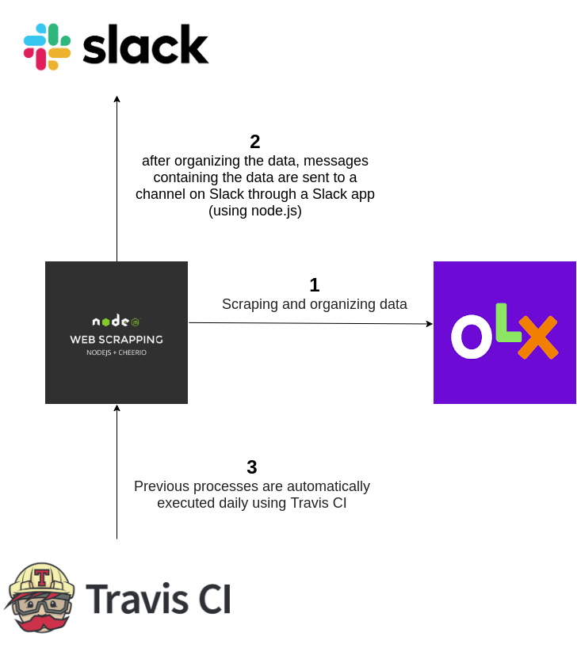

# olx-scrapper

## Project 💻

Olx scrapper takes data from [OLX's website](https://www.olx.com.br/) and sends it to a Slack channel through a [slack app](https://smartphonesolx.slack.com/apps).
 

## Techs :rocket:

- [Node.js](https://nodejs.org/en/)
- [Cheerio](https://cheerio.js.org/)
- [Slack App](https://smartphonesolx.slack.com/apps)
- [Travis CI](https://travis-ci.org/)

 

## Pipeline

## License :memo:

- **[MIT license](https://github.com/byronkamal/BeTheHero/blob/master/LICENSE)**
- Copyright 2020 © <a href="https://github.com/byronkamal" target="_blank">Byron Kamal</a>.

##
